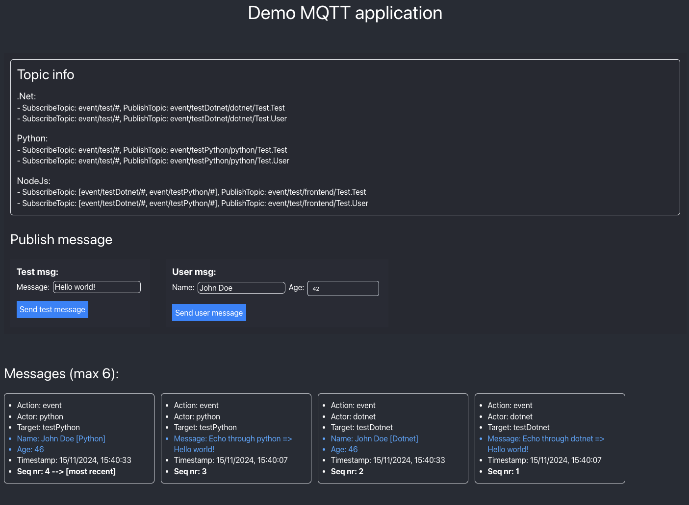

# Mqtt with protobuf
This project demonstrates how a dotnet, python and nodejs app can communicate with each other using protobuf messages over MQTT. For each of these 3 applications, I created a service that parses MQTT messages automaticly into the correct object to simplify further processing.



## 🔥 Quickstart
1. Start mqtt broker using the docker compose.
2. Execute the sh file in `devops/scripts` to generate the protobuf files in each of the 3 applications. Be aware that you also have to create an index.ts file inside `Nodejs/web-app/src/protobuf`! This can be done as follow:
```typescript
import { Test, User } from './Test'; //extend when adding more messages inside the Test.proto file
//add additional imports when creating new proto files

export const Components = {
	Test,
	User
};
```
3. Go to Python project, create virtual env, install the packages with `pip install -r requirements` and run the code with `python Python/src/main.py`.
4. Go to Dotnet project and run app with command `dotnet run`
5. Go to Nodejs project, install packages with `npm install` and run the code with `npm start`.
6. Go to `http://localhost:3000/` to view the demo mqtt application.

## 🧑‍💻 Debugging
You can debug each project. The settings are located in the .vscode directory. Make sure to adjust the 'python' property in case your virtual env is not located under the Python directory.

## 📚 Mqtt service: brief overview
The structure of the MQTT service varies across different projects. The Dotnet and Python implementations share a similar architecture, while the Nodejs project is different. The frontend application needs to render results which complicates things and TypeScript lacks pattern matching integration, which is used in Dotnet and Python to build message handlers.

### Topics
MQTT topics are structured, beginning with an action keyword: state, event, or command. This is followed by a target, which can be freely defined based on the application’s needs. The third part is the actorId, which identifies the sender of the message. The topic concludes with the message class, which is essential for automatically parsing the incoming Protobuf messages. This last part contains the message namespace and message type seperated with a dot.

### Parsers
When a message is received, its payload is in raw byte format and needs to be converted into a structured object. This transformation is automatically handled based on the message namespace and type provided in the topic, enabling seamless parsing of the message into the correct object representation.

### Handlers
Once the message is parsed, it is passed to the appropriate handlers for further processing. A handler can only process a message if it has subscribed to the relevant topic. Handlers leverage pattern matching to ensure they can process messages of the correct type.

## ✅ TODO
- make the mqtt service in all projects async
- make a docker file for each project
- create an sh file to start all projects at once
- make the env variables in each project more consistent
- improve typesafety inside the Nodejs project
- create protobuf directory automaticly in all the projects in case it doesn't exist
- bug fix: nodejs app sometimes disconnects with the mqtt broker at start (temporary fix: refresh the page until it works)